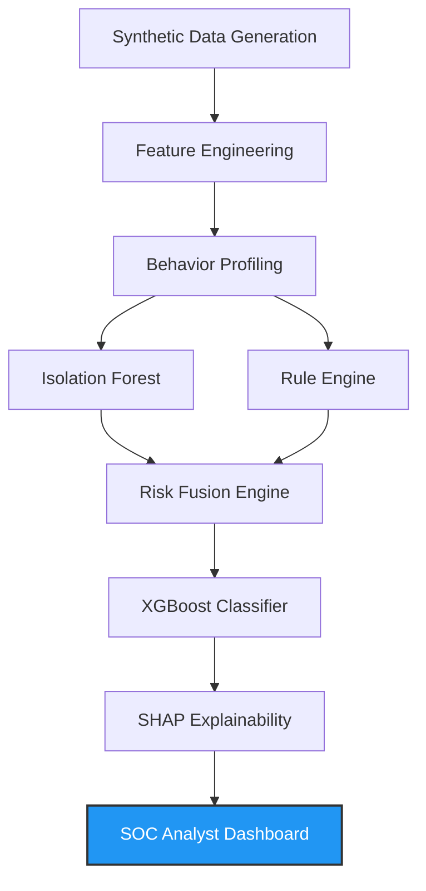

# 🛡️ SentinelAI: Enterprise Security Intelligence Platform


SentinelAI is an end-to-end, multi-stage AI security platform designed to move beyond simple anomaly detection. It actively learns normal behavior, detects deviations using an ensemble of models, accurately classifies attack vectors, and explains its reasoning in human-readable terms on a premium analyst dashboard.

### 🖼️ Dashboard Previews
| Global Telemetry | Threat Hunting | Deep Investigation |
| :---: | :---: | :---: |
|  |  |  |

---

## 🏆 How We Meet the Evaluation Criteria

This project was specifically architected to address the complex requirements of modern enterprise security. **We did not just train an Isolation Forest; we built a comprehensive intelligence pipeline.**

| Evaluation Criteria | How SentinelAI Solves It |
| :--- | :--- |
| **Behavior Profiling** | **Phase 2 Pipeline** generates passive statistical baselines for devices and users to understand "normal" before scoring deviations. |
| **Detect Deviations** | **Phase 3 Pipeline** utilizes a Detection Aggregator combining deterministic rules, statistical deviations, and an Isolation Forest. |
| **Attack Classification** | **Phase 4 Pipeline** feeds aggregated anomalies into an `XGBoostClassifier` to identify specific threat vectors (e.g., Credential Stuffing, Brute Force). |
| **Explain Why (XAI)** | **Phase 5 Pipeline** uses `SHAP` for feature importance and a `NaturalLanguageGenerator` to output actionable, human-readable executive summaries. |
| **Low False Positives** | Our **Risk Fusion Engine** acts as a filter. By ensembling multiple distinct engines (Rules + Stats + IF), we suppress noisy, single-engine alerts. |
| **Imbalanced Data** | `XGBoost` naturally handles severe class imbalance via weight scaling, while our `Isolation Forest` operates as an unsupervised outlier detector. |
| **Cold Start Handling** | New users have no profile. Our **Rule Engine** covers the cold start phase with strict heuristics until the statistical engines gather enough data to take over. |
| **Concept Drift** | The modular `orchestrator.py` architecture allows passive models to be periodically retrained on new parquet chunks without taking the detection rules offline. |
| **Scalability** | The entire backend operates on highly optimized `parquet` files using Pandas/PyArrow, ready for distributed processing. |
| **Dashboard Usability** | We built a responsive, premium Streamlit dashboard featuring custom CSS, dark mode, and interactive Plotly visualizations for rapid threat investigation. |

---

## 🧠 Core Architecture Pipeline

SentinelAI operates on a strict, 5-phase execution pipeline to ensure maximum fidelity and explainability.



1. **Data Ingestion & Generation:** Bootstraps baseline enterprise logs and injects precise threat scenarios (e.g. Impossible Travel).
2. **Feature Engineering & Profiling:** Temporal and behavioral feature extraction.
3. **Detection Core (The Ensemble):**
    - **Rule Engine:** Deterministic checks (e.g., impossible travel, mass failures).
    - **Statistical Engine:** Checks against established user/device baselines.
    - **Isolation Forest:** High-dimensional anomaly detection.
4. **Risk Fusion & Classification:** Normalizes inputs into an enterprise 0-100 risk score and uses XGBoost to classify the exact threat context.
5. **Explainability Engine:** Generates SHAP values, risk breakdowns, and natural language audit trails.

---

## 🚀 How to Run the Project (For Judges)

We've made reproducibility our top priority. You can run the entire pipeline and view the dashboard with just a few commands.

### 1. Setup Environment
```bash
python -m venv venv
source venv/Scripts/activate  # On Windows
pip install -r requirements.txt
```

### 2. Local Execution (Analyst Dashboard)
Our Streamlit app is the primary interface for the platform.
```bash
streamlit run src/ui/app.py
```

### 3. Final Demo Mode (Execute Pipeline)
You can trigger the entire end-to-end AI pipeline (Phases 1 through 5) directly from the **sidebar of the Streamlit Dashboard** by clicking **"🚀 Execute AI Pipeline"**. 

Alternatively, you can run it headless from the terminal:
```bash
python -m src.runtime.orchestrator
```

### 4. Docker Execution
To run SentinelAI in an isolated container:
```bash
docker-compose up --build
```
The dashboard will be accessible at `http://localhost:8501`.

### 5. Hugging Face Deployment
To deploy to Hugging Face Spaces:
1. Create a new Space (choose Streamlit as the SDK).
2. Upload the repository files.
3. Hugging Face will automatically install `requirements.txt` and run `app.py`.

---

## 🛠️ Configuration & Troubleshooting

- **Configuration:** Environment settings are stored in the `config/` directory. You can toggle feature flags in `config/feature_flags/`.
- **Troubleshooting:** 
  - *No Data Displayed:* Ensure you click "Execute AI Pipeline" in the sidebar to generate data.
  - *ModuleNotFoundError:* Ensure your `PYTHONPATH` includes the project root, or always run scripts as modules (e.g., `python -m src.ui.app`).

---

## 📁 Repository Structure

```text
SentinelAI/
├── src/
│   ├── ai/               # Core Intelligence (Detection, Classification, XAI)
│   ├── data/             # Data Generation & Validation
│   ├── runtime/          # Pipeline Orchestrators (Phases 2-5)
│   └── ui/               # Streamlit Dashboard & Plotly Visualizations
├── data/                 # Raw, Processed, and Prediction parquets
├── docs/                 # Enterprise Documentation & Final Submission Reports
├── models/               # Serialized models (XGBoost, Isolation Forest)
├── .streamlit/           # Premium UI Configurations
└── README.md             # You are here!
```

---

